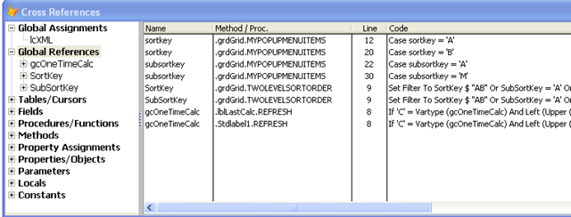

### IDE Tools: Cross References

Applies to tools:

*   *Cross References: This method*
*   *Cross References: This form / class*
*   *Cross References: This form / class and children*
*   *Cross References: Current object*
*   *Cross References: Current object and children*

> Note that ‘Children’ here means: all the child objects of the control, down through the entire tree of objects.

The **Cross References** screen (see sample below) creates an analysis of all of the 'names' referenced in a PRG, method, or collection of methods.  These names are broken down into about a dozen different categories;  the TreeView on the left provides for navigation between the categories and the names within each category, and the grid on the right shows where the names are referenced.  Double-clicking on a row in the grid opens the indicated method and highlights the relevant line of code.

### Analysis / Categories in the TreeView
The Cross References screen breaks the 'names' referenced in code into about a dozen distinct categories.  The 'names' actually include extended names, so that references to objects ('This.lblName.SomeProperty') or tables ('Customers.Name') are treated as single references.  Furthermore, references within WITH/ENDWITH blocks are resolved to point to the object named in the WITH statement.  (This even applies to embedded WITH/ENDWITH blocks). The categories and their definitions are:

Caption|Description
---|---
*Global Assignments* |Simple names that are assigned values, but are not locals or parameters
*Global References* |Simple names that are referenced, but are not locals or parameters
*Tables/Cursors* |References to names in VFP statements that indicate a table or cursor
*Fields* |References to names in SQL-Select statements
*Forms* |Do Form …
*Procedures/Functions* |Calls to PRGs, or procedures or functions within PRGs.
*Methods* |Calls to methods
*Property Assignments* |References to properties or objects that ***are*** assigned values
*Properties/Objects* |References to properties or objects that ***are not*** assigned values
*Parameters* |  
*Locals* | 
*Constants* |compiler constants (#Define ...)

**<u>Warranty Information:</u>** This categorization cannot be perfect -- it is only at run time that VFP itself can properly identify which category any name falls into.  While the first two and last three categories are completely reliable (_global assignments_ and _references, parameters, locals_, and _compiler constants_), the remainder cannot be, and so there are instances where names will be reported in the incorrect category.  For instance, 'Customers.Name' certainly looks like a reference to a field in a table, but 'Customers' could (conceivably) actually be an object reference.

<u>**The Grid:** </u>The four columns may be moved or resized them as desired; their size and order will be remembered for next time. The grid displays one record for each line of code that a name is referenced on.  If you double-click on one of the records, the method/PRG will be opened and the line of code will be displayed. There is a possible point of confusion when references are to code that is created on continuation lines.  The analysis of code in this screen treats code on continuation lines as a single line of code.  Thus, double-clicking to a reference in the grid will always highlight the ***first*** line in a set of continuation lines, even if the actual reference is to a later line in that subset.

<u>**Customization:** </u>There is a right-click context menu for the TreeView that allows for some customization:

*   You can select which of the categories are automatically expanded when the screen is first opened.  (By default, all categories are collapsed).
*   You can select which single category is initially selected when the screen is first opened (causing the references to the items in that category to appear in the grid.